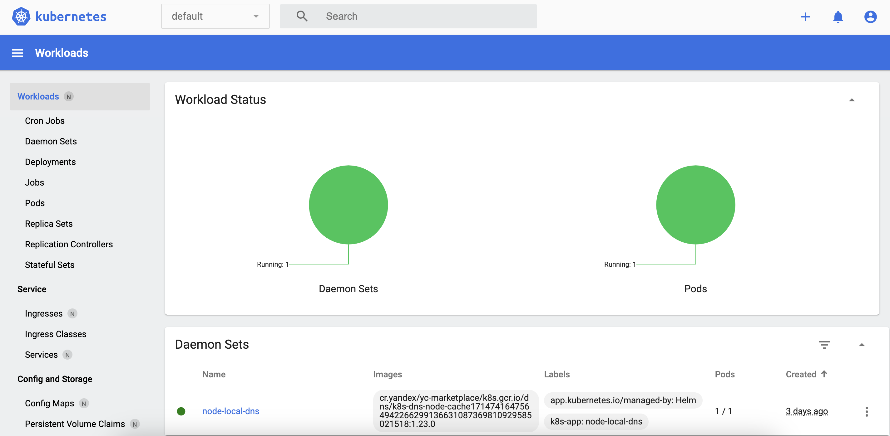
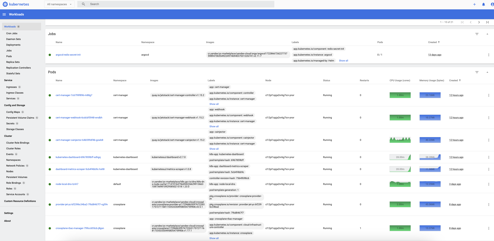
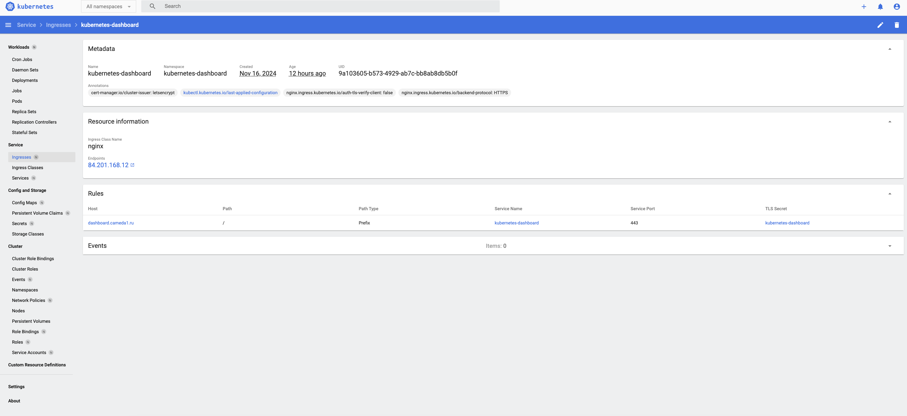
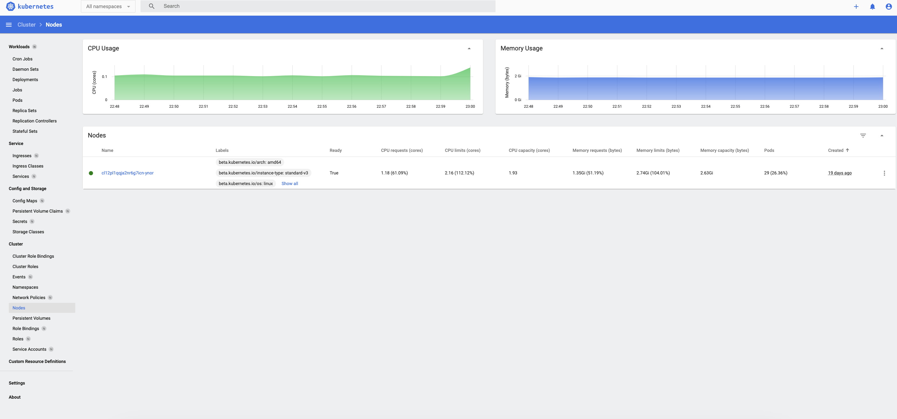
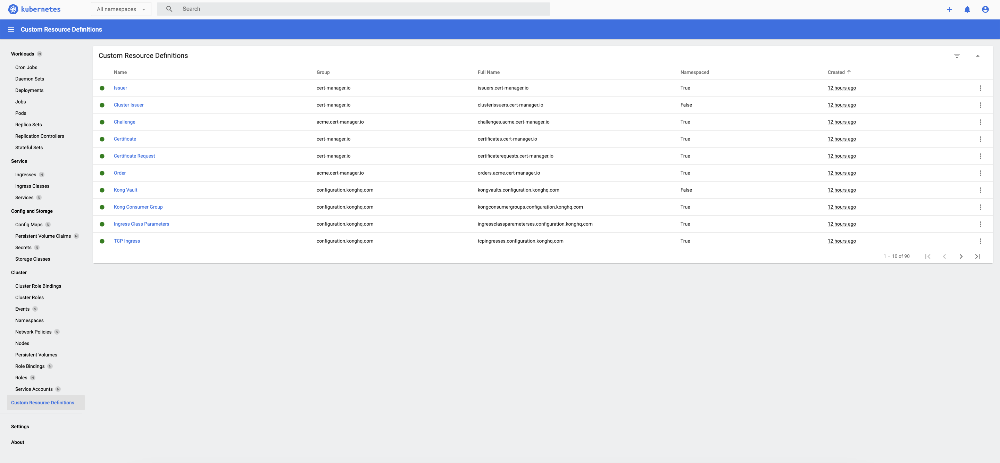

# Kubernetes-dashboard

## Описание.
Простенький, базовый дашборд для работы с Kubernetes. Поддерживается сообществом.

## Установка.
```
kubectl apply -f https://raw.githubusercontent.com/kubernetes/dashboard/v2.7.0/aio/deploy/recommended.yaml
```

## Доступ к дашборду.

### Proxy.
```
kubectl proxy

# Адрес странички в интернете.
http://localhost:8001/api/v1/namespaces/kubernetes-dashboard/services/https:kubernetes-dashboard:/proxy/
```

### Ingress.
Создание правила ingress для kubernetes dashboard описано тут: https://github.com/Cameda/public_solutions/blob/main/kubernetes_extended/ingress-nginx/solutions/kubernetes-dashboard.md

## Подключение.

### Для подключения нужен сервисный аккаунт.
```
cat <<EOF | kubectl apply -f -
apiVersion: v1
kind: ServiceAccount
metadata:
  name: admin-user
  namespace: kubernetes-dashboard
---
apiVersion: rbac.authorization.k8s.io/v1
kind: ClusterRoleBinding
metadata:
  name: admin-user
roleRef:
  apiGroup: rbac.authorization.k8s.io
  kind: ClusterRole
  name: cluster-admin
subjects:
- kind: ServiceAccount
  name: admin-user
  namespace: kubernetes-dashboard
EOF
```

### Генерируем токен.
```
kubectl create token admin-user -n kubernetes-dashboard
```

## Вид главного окна.
<h1 align="center">
    
</h1>

<h1 align="center">
    
</h1>

<h1 align="center">
    
</h1>

<h1 align="center">
    
</h1>

<h1 align="center">
    
</h1>

## Полезные ссылки.
https://kubernetes.io/docs/tasks/access-application-cluster/web-ui-dashboard/
